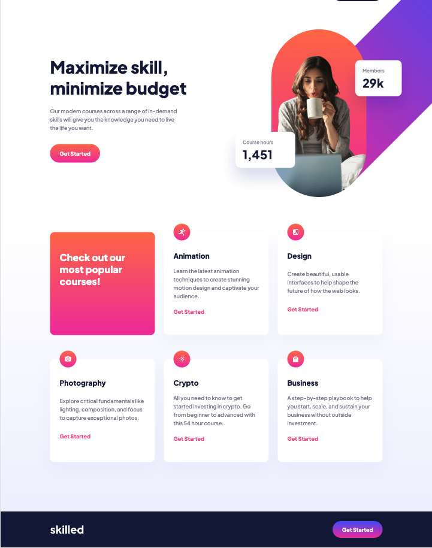

# Frontend Mentor - Skilled e-learning landing page solution

This is a solution to the [Skilled e-learning landing page challenge on Frontend Mentor](https://www.frontendmentor.io/challenges/skilled-elearning-landing-page-S1ObDrZ8q).

## Table of contents

- [Overview](#overview)
  - [The challenge](#the-challenge)
  - [Screenshot](#screenshot)
  - [Links](#links)
- [Author](#author)
- [Acknowledgments](#acknowledgments)

## Overview

### The challenge

Users should be able to:

- View the optimal layout depending on their device's screen size
- See hover states for interactive elements

### Screenshot

### Links

- Solution URL: [https://joaocln88.github.io/FrontendMentor-SkllledELearningLandingPage/](https://joaocln88.github.io/FrontendMentor-SkllledELearningLandingPage/)

## Author

- Github - [João Corrêa](https://github.com/joaocln88)
- Frontend Mentor - [@joaocln88](https://www.frontendmentor.io/profile/joaocln88)

## Acknowledgments

Thanks to Frontend Mentor, who provided the challange and all useful details to accomplish it.
